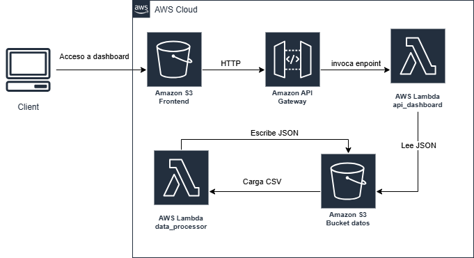

# Prueba tecnica data netflix

## Objetivo

Este proyecto implementa una solución serverless en AWS para procesar un dataset de comportamiento de usuarios de netflix y exponer métricas (KPIs), visualizaciones y filtros a través de un dashboard web.

---

## Descripción de la arquitectura

La arquitectura está basada en servicios serverless de AWS y se divide en tres capas principales:

## Capa de visualización
- **Amazon S3 (Frontend Website)**
    - `index.html`
    - `app.js`
    - `style.css`
    - `config.js`

- El usuario accede al dashboard directamente desde este bucket.

## Capa de exposición API
- **Amazon API Gateway**
  - Expone endpoints HTTP:
    - `/health`
    - `/kpis`
    - `/charts`
    - `/filters`

- **AWS Lambda - `api_dashboard`**
  - Maneja las solicitudes del API
  - Consulta archivos JSON procesados en S3
  - Retorna los datos al frontend

## Capa de procesamiento de datos
- **Amazon S3 (Data Bucket)**
  - Almacena:
    - CSV de entrada:
      - `input/netflix_user_behavior_dataset.csv`
    - Archivos procesados:
      - `processed/kpis.json`
      - `processed/charts.json`
      - `processed/filters.json`

- **AWS Lambda - `data_processor`**
  - Se activa automáticamente al cargar un CSV en S3
  - Procesa los datos
  - Genera los archivos JSON utilizados por el dashboard

---

## Diagrama de arquitectura




---

## Componentes implementados

La solución incluye los siguientes componentes de infraestructura:

Terraform - Infraestructura como código
AWS S3 - almacenamiento y frontend
AWS Lambda - procesamiento y API
API Gateway - exposición de endpoints
JavaScript y ECharts - visualización de datos

---

## Instrucciones para desplegar

### 1. Clonar el repositorio

```bash
git clone <https://github.com/jeissonjahvier10/data-netflix-dashboard.git>
cd prueba_tecnica_nuptum/terraform
```
### 2. Inicializar Terraform
```bash
terraform init
```
### 3. Revisar el plan de despliegue
```bash
terraform plan
```
### 4. Aplicar la infraestructura
```bash
terraform apply
```
Terraform pedirá confirmar antes de crear los recursos. 
Escribir:
yes
### 5. Obtener la URL de la aplicación
Una vez finalizado el despliegue, ejecutar:
```bash
terraform output api_url
terraform output frontend_website_url
```
Abrir la URL en el navegador.

## Validar endponits

API_URL/health 
API_URL/kpis 
API_URL/charts 
API_URL/filters

### 7. Eliminación de la infraestructura
Para eliminar todos los recursos creados por Terraform ejecutar:
```bash
terraform destroy
```

